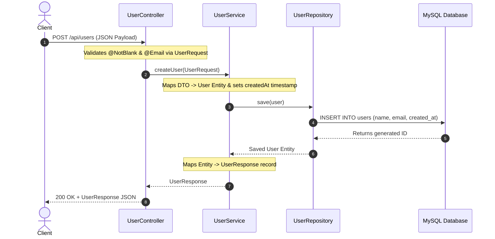
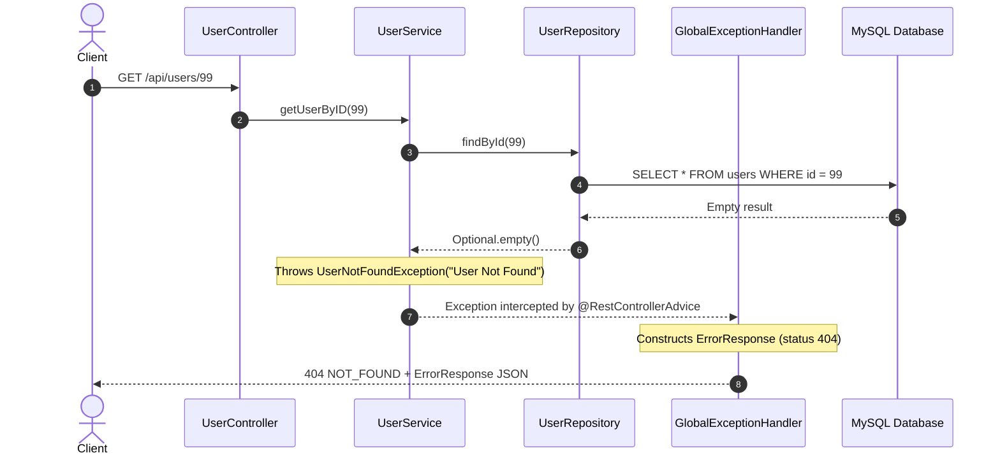

# Finance API Service

A RESTful Microservice API built with **Spring Boot 3** and **Java 21** for managing User domain data using **Spring Data JPA** and **MySQL**.

---

## 🛠️ Tech Stack & Dependencies

* **Language**: Java 21
* **Framework**: Spring Boot 3 (`spring-boot-starter-webmvc`, `spring-boot-starter-data-jpa`, `spring-boot-starter-validation`)
* **Database**: MySQL (`mysql-connector-j`)
* **API Documentation**: SpringDoc OpenAPI / Swagger UI (`springdoc-openapi-starter-webmvc-ui`)
* **Build Tool**: Maven

---

## 📂 Project Architecture & File Structure

The project follows a standard layered Java enterprise architecture:

```
src/main/java/com/example/finance/
├── FinanceApplication.java             # Main application entry point
├── config/
│   └── SwaggerConfig.java              # Auto-opens Swagger UI on startup
├── controller/
│   └── UserController.java             # REST Controller exposing endpoints (/api/users)
├── service/
│   └── UserService.java                # Business logic & DTO transformation layer
├── repository/
│   └── UserRepository.java             # Data access repository (Spring Data JPA)
├── entity/
│   └── User.java                       # JPA Entity for MySQL table "users"
├── dto/
│   ├── request/
│   │   └── UserRequest.java            # Immutable record payload for user creation
│   └── response/
│       ├── UserResponse.java           # Success response record payload
│       └── ErrorResponse.java          # Error response structure
└── exception/
    ├── UserNotFoundException.java      # Custom runtime exception
    └── GlobalExceptionHandler.java     # Centralized HTTP exception handler (@RestControllerAdvice)
```

---

## ⚙️ Configuration & Database Setup

The application connects to MySQL via `src/main/resources/application.properties`:

```properties
spring.application.name=finance
spring.datasource.url=jdbc:mysql://localhost:3306/FinanceDB
spring.datasource.username=root
spring.datasource.password=root
spring.datasource.driver-class-name=com.mysql.cj.jdbc.Driver

spring.jpa.hibernate.ddl-auto=update
spring.jpa.show-sql=true
spring.jpa.properties.hibernate.format_sql=true
```

Ensure MySQL is running on `localhost:3306` with the `FinanceDB` database created.

---

## 🚀 Step-by-Step Execution Flow

### 1. Application Startup Flow

1. **Main Entry**: Execution begins at `main()` in `FinanceApplication.java`.
2. **Context Load**: `SpringApplication.run(...)` initializes the Spring ApplicationContext and reads configuration from `application.properties`.
3. **Database Schema Setup**: HikariCP connects to `jdbc:mysql://localhost:3306/FinanceDB`, and Hibernate automatically creates or updates the `users` table corresponding to the `User` entity.
4. **Bean Registration**: Spring instantiates `@Service` (`UserService`), `@RestController` (`UserController`), and generates Spring Data JPA proxy implementations for `UserRepository`.
5. **Swagger UI Launch**: Once initialized (`ApplicationReadyEvent`), `SwaggerConfig.java` opens the system browser automatically to `http://localhost:8080/swagger-ui/index.html`.

---

### 2. User Creation Flow (`POST /api/users`)



1. **Client Request**: Client sends a `POST` request to `/api/users` with payload: `{"name": "John", "email": "john@example.com"}`.
2. **Validation**: Spring Web MVC inspects `@Valid @RequestBody UserRequest request`. If `name` or `email` is invalid or blank, Spring throws a validation exception before method execution.
3. **Service Logic**: `UserService.createUser()` creates a `User` entity and sets `createdAt` with `LocalDateTime.now()`.
4. **Database Operations**: `userRepository.save(user)` runs an SQL `INSERT` statement into MySQL table `users`.
5. **Response Mapping**: The saved entity is converted into a `UserResponse` record (`id`, `name`, `email`, `createdAt`) and returned as JSON.

---

### 3. Fetch User by ID Flow (`GET /api/users/{id}`)



1. **Client Request**: Client sends `GET /api/users/{id}`.
2. **Repository Lookup**: `userRepository.findById(id)` executes `SELECT * FROM users WHERE id = {id}`.
3. **Exception Handling**:
   * If the user is found, the user entity is returned.
   * If not found, `UserService` throws `UserNotFoundException`.
   * `GlobalExceptionHandler` intercepts `UserNotFoundException`, constructs an `ErrorResponse` (HTTP 404), and returns JSON error context.

---

## 📡 API Endpoints Summary

| Method | Endpoint | Description | Request Body | Response |
|---|---|---|---|---|
| `POST` | `/api/users` | Create a new user | `UserRequest` | `UserResponse` (200 OK) |
| `GET` | `/api/users` | Get all users | None | `List<User>` (200 OK) |
| `GET` | `/api/users/{id}` | Get user by ID | None | `User` (200 OK) / `ErrorResponse` (404 Not Found) |

---

## 📖 Swagger Documentation UI

Once the application is running, open:
`http://localhost:8080/swagger-ui/index.html`
