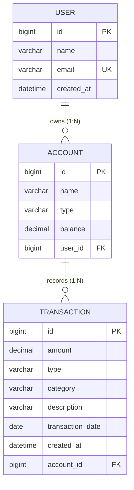
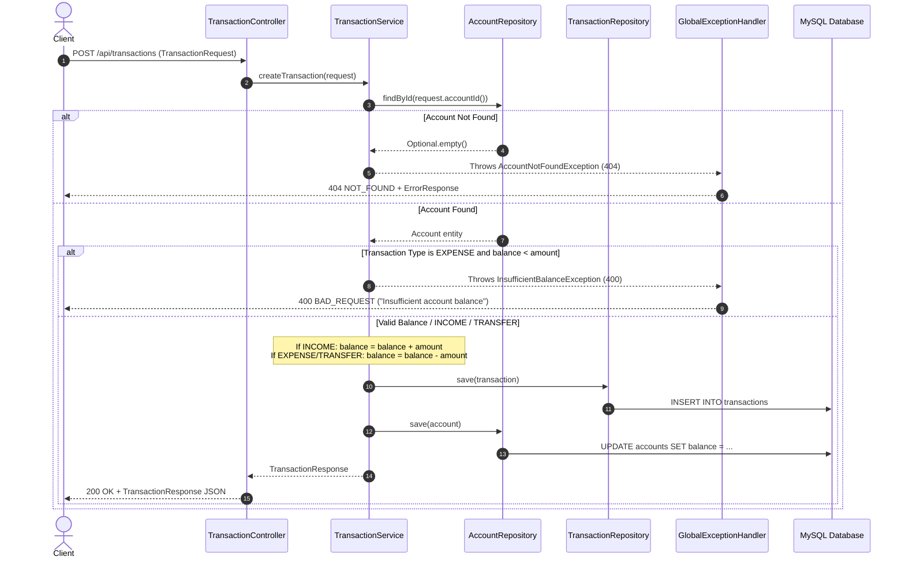

# Finance API Service

A comprehensive Personal Finance Management RESTful Microservice API built with **Spring Boot** and **Java 21**, managing **Users**, **Accounts**, and **Transactions** with transactional balance calculations, Spring Data JPA, and MySQL.

---

## 🛠️ Tech Stack & Dependencies

* **Language**: Java 21
* **Framework**: Spring Boot (`spring-boot-starter-webmvc`, `spring-boot-starter-data-jpa`, `spring-boot-starter-validation`)
* **Database**: MySQL (`mysql-connector-j`)
* **ORM / Persistence**: Hibernate & Spring Data JPA
* **API Documentation**: SpringDoc OpenAPI / Swagger UI (`springdoc-openapi-starter-webmvc-ui`)
* **Build Tool**: Maven

---

## 📂 Project Architecture & File Structure

The project follows a standard layered Java enterprise architecture with clean DTO record mapping, relational entities, transactional services, and centralized exception handling:

```
src/main/java/com/example/finance/
├── FinanceApplication.java                 # Main application entry point
├── config/
│   └── SwaggerConfig.java                  # Auto-opens Swagger UI on startup
├── controller/
│   ├── UserController.java                 # REST Controller for Users (/api/users)
│   ├── AccountController.java              # REST Controller for Accounts (/api/accounts)
│   └── TransactionController.java          # REST Controller for Transactions (/api/transactions)
├── service/
│   ├── UserService.java                    # User domain logic, duplicate email checks & CRUD
│   ├── AccountService.java                 # Account domain logic & user ownership association
│   └── TransactionService.java             # Transactional balance processing & ledger adjustments
├── repository/
│   ├── UserRepository.java                 # JPA Repository for User entity (existsByEmail)
│   ├── AccountRepository.java              # JPA Repository for Account entity (findByUserId)
│   └── TransactionRepository.java          # JPA Repository for Transaction entity (queries by account/type/category)
├── entity/
│   ├── User.java                           # JPA Entity for "users" table (1:N with Account)
│   ├── Account.java                        # JPA Entity for "accounts" table (N:1 User, 1:N Transaction)
│   ├── Transaction.java                    # JPA Entity for "transactions" table (N:1 Account)
│   └── TransactionType.java                # Enum: INCOME, EXPENSE, TRANSFER
├── dto/
│   ├── request/
│   │   ├── UserRequest.java                # Payload for user creation
│   │   ├── UserUpdateRequest.java          # Payload for user update
│   │   ├── AccountRequest.java             # Payload for account creation
│   │   ├── AccountUpdateRequest.java       # Payload for account update
│   │   ├── TransactionRequest.java         # Payload for transaction creation
│   │   └── TransactionUpdateRequest.java   # Payload for transaction update
│   └── response/
│       ├── UserResponse.java               # User response payload
│       ├── AccountResponse.java            # Account response payload
│       ├── TransactionResponse.java        # Transaction response payload
│       ├── ValidationErrorResponse.java    # Field-level validation error response (400)
│       └── ErrorResponse.java              # Standard error response (400, 404, 409)
└── exception/
    ├── UserNotFoundException.java          # Missing user runtime exception (404)
    ├── UserAlreadyExistsException.java     # Duplicate email runtime exception (409)
    ├── AccountNotFoundException.java       # Missing account runtime exception (404)
    ├── TransactionNotFoundException.java   # Missing transaction runtime exception (404)
    ├── InsufficientBalanceException.java   # Insufficient balance for expense runtime exception (400)
    └── GlobalExceptionHandler.java         # Centralized HTTP exception handler (@RestControllerAdvice)
```

---

## 🗄️ Relational Domain Model



* **User**: Can own multiple Accounts. Email is unique across all users.
* **Account**: Belongs to a single User. Contains a monetary balance (`precision = 15, scale = 2`).
* **Transaction**: Belongs to an Account. Types: `INCOME`, `EXPENSE`, `TRANSFER`.

---

## ⚙️ Configuration & Database Setup

The application connects to MySQL via `src/main/resources/application.properties`:

```properties
spring.application.name=finance
spring.datasource.url=jdbc:mysql://localhost:3306/FinanceDB
spring.datasource.username=root
spring.datasource.password=root
spring.datasource.driver-class-name=com.mysql.cj.jdbc.Driver

spring.jpa.hibernate.ddl-auto=update
spring.jpa.show-sql=true
spring.jpa.properties.hibernate.format_sql=true
```

Ensure MySQL is running on `localhost:3306` with the `FinanceDB` database created:

```sql
CREATE DATABASE IF NOT EXISTS FinanceDB;
```

---

## 🚀 Key Business Logic & Execution Flows

### 1. Application Startup Flow

1. **Main Entry**: Starts at `FinanceApplication.main()`.
2. **Context & Persistence**: Initializes Spring Boot context; Hibernate automatically verifies/updates `users`, `accounts`, and `transactions` tables with foreign keys and unique constraints.
3. **Swagger UI Auto-Launch**: Once started, `SwaggerConfig.java` opens `http://localhost:8080/swagger-ui/index.html` in the system default browser.

---

### 2. User Management Flows (`/api/users`)

* **Create User (`POST /api/users`)**:
  1. Validates `UserRequest` (`@NotBlank name`, `@NotBlank @Email email`).
  2. Checks `userRepository.existsByEmail()`. Throws `UserAlreadyExistsException` (409) if duplicate.
  3. Saves user with `LocalDateTime.now()` and returns `UserResponse`.
* **Update User (`PUT /api/users/{id}`)**:
  1. Finds existing user or throws `UserNotFoundException` (404).
  2. If the email is being changed, ensures no other user owns that email (`existsByEmail()`), otherwise throws `UserAlreadyExistsException` (409).
  3. Updates name and email, saves, and returns `UserResponse`.
* **Delete User (`DELETE /api/users/{id}`)**:
  1. Checks if user exists; throws `UserNotFoundException` (404) if not found.
  2. Deletes user record and returns `204 No Content`.

---

### 3. Account Management Flows (`/api/accounts`)

* **Create Account (`POST /api/accounts`)**:
  1. Validates `AccountRequest` (name, type, balance >= 0, userId).
  2. Verifies user exists via `userRepository.findById(request.userId())`. If absent, throws `UserNotFoundException` (404).
  3. Instantiates `Account` linked to the `User`, saves, and returns `AccountResponse`.
* **Get Accounts by User (`GET /api/accounts/user/{userId}`)**:
  1. Verifies user exists; throws `UserNotFoundException` (404) if missing.
  2. Fetches all accounts owned by `userId` using `accountRepository.findByUserId(userId)`.
* **Update Account (`PUT /api/accounts/{id}`)**:
  1. Locates account by ID or throws `AccountNotFoundException` (404).
  2. Updates name, type, and balance; saves and returns `AccountResponse`.
* **Delete Account (`DELETE /api/accounts/{id}`)**:
  1. Locates account by ID or throws `AccountNotFoundException` (404).
  2. Deletes account and returns `204 No Content`.

---

### 4. Transaction Creation & Balance Calculation Flow (`POST /api/transactions`)

Every transaction adjusts the corresponding account balance within a `@Transactional` boundary:



---

### 5. Transaction Update Flow (`PUT /api/transactions/{id}`)

Transaction updates safely adjust account balances in 5 atomic steps:

1. **Fetch**: Find existing transaction or throw `TransactionNotFoundException` (404).
2. **Reverse Old Effect**:
   - If old type was `INCOME`: `balance = balance - oldAmount`
   - If old type was `EXPENSE`/`TRANSFER`: `balance = balance + oldAmount`
3. **Validate New Transaction**:
   - If new type is `EXPENSE` and reversed `balance < newAmount`: throw `InsufficientBalanceException` (400).
4. **Apply New Effect**:
   - If new type is `INCOME`: `balance = balance + newAmount`
   - If new type is `EXPENSE`/`TRANSFER`: `balance = balance - newAmount`
5. **Persist**: Update transaction properties (`amount`, `type`, `category`, `description`, `transactionDate`), save transaction, save updated account balance, and return `TransactionResponse`.

---

### 6. Transaction Deletion Flow (`DELETE /api/transactions/{id}`)

1. Locates transaction by ID or throws `TransactionNotFoundException` (404).
2. **Reverses** the effect on the associated account balance:
   - If `INCOME`: `balance = balance - amount`
   - If `EXPENSE`/`TRANSFER`: `balance = balance + amount`
3. Deletes the transaction from `transactionRepository`.
4. Saves updated account balance to `accountRepository`.
5. Returns `204 No Content`.

---

## 📡 API Endpoints Summary

### User Endpoints (`/api/users`)

| Method | Endpoint | Description | Request Body | Success Code | Error Codes |
|---|---|---|---|---|---|
| `POST` | `/api/users` | Create user | `UserRequest` | `200 OK` | `400 BAD_REQUEST`, `409 CONFLICT` |
| `GET` | `/api/users` | Get all users | *None* | `200 OK` | — |
| `GET` | `/api/users/{id}` | Get user by ID | *None* | `200 OK` | `404 NOT_FOUND` |
| `PUT` | `/api/users/{id}` | Update user | `UserUpdateRequest` | `200 OK` | `400 BAD_REQUEST`, `404 NOT_FOUND`, `409 CONFLICT` |
| `DELETE` | `/api/users/{id}` | Delete user | *None* | `204 NO_CONTENT` | `404 NOT_FOUND` |

### Account Endpoints (`/api/accounts`)

| Method | Endpoint | Description | Request Body | Success Code | Error Codes |
|---|---|---|---|---|---|
| `POST` | `/api/accounts` | Create account | `AccountRequest` | `200 OK` | `400 BAD_REQUEST`, `404 NOT_FOUND` (User missing) |
| `GET` | `/api/accounts` | Get all accounts | *None* | `200 OK` | — |
| `GET` | `/api/accounts/{id}` | Get account by ID | *None* | `200 OK` | `404 NOT_FOUND` |
| `GET` | `/api/accounts/user/{userId}` | Get accounts by User ID | *None* | `200 OK` | `404 NOT_FOUND` (User missing) |
| `PUT` | `/api/accounts/{id}` | Update account | `AccountUpdateRequest` | `200 OK` | `400 BAD_REQUEST`, `404 NOT_FOUND` |
| `DELETE` | `/api/accounts/{id}` | Delete account | *None* | `204 NO_CONTENT` | `404 NOT_FOUND` |

### Transaction Endpoints (`/api/transactions`)

| Method | Endpoint | Description | Request Body | Success Code | Error Codes |
|---|---|---|---|---|---|
| `POST` | `/api/transactions` | Create transaction & adjust balance | `TransactionRequest` | `200 OK` | `400 BAD_REQUEST` (Validation / Insufficient Balance), `404 NOT_FOUND` (Account missing) |
| `GET` | `/api/transactions` | Get all transactions | *None* | `200 OK` | — |
| `GET` | `/api/transactions/{id}` | Get transaction by ID | *None* | `200 OK` | `404 NOT_FOUND` |
| `PUT` | `/api/transactions/{id}` | Update transaction & adjust balance | `TransactionUpdateRequest` | `200 OK` | `400 BAD_REQUEST` (Validation / Insufficient Balance), `404 NOT_FOUND` |
| `DELETE` | `/api/transactions/{id}` | Delete transaction & revert balance | *None* | `204 NO_CONTENT` | `404 NOT_FOUND` |

---

## 📋 Request & Response Models

### 1. User Models

#### `UserRequest` (Create)
```json
{
  "name": "John Doe",
  "email": "john.doe@example.com"
}
```
* `name`: `@NotBlank(message = "Name is required")`
* `email`: `@NotBlank(message = "Email is required")`, `@Email(message = "Invalid email format")`

#### `UserUpdateRequest` (Update)
```json
{
  "name": "John Doe Updated",
  "email": "john.updated@example.com"
}
```

#### `UserResponse`
```json
{
  "id": 1,
  "name": "John Doe",
  "email": "john.doe@example.com",
  "createdAt": "2026-09-25T10:15:30"
}
```

---

### 2. Account Models

#### `AccountRequest` (Create)
```json
{
  "name": "Checking Account",
  "type": "CHECKING",
  "balance": 1500.00,
  "userId": 1
}
```
* `name`: `@NotBlank(message = "Account name is required")`
* `type`: `@NotBlank(message = "Account type is required")`
* `balance`: `@NotNull(message = "Balance is required")`, `@DecimalMin(value = "0.0", message = "Balance cannot be negative")`
* `userId`: `@NotNull(message = "User ID is required")`

#### `AccountUpdateRequest` (Update)
```json
{
  "name": "Primary Savings",
  "type": "SAVINGS",
  "balance": 2000.00
}
```

#### `AccountResponse`
```json
{
  "id": 1,
  "name": "Checking Account",
  "type": "CHECKING",
  "balance": 1500.00,
  "userId": 1
}
```

---

### 3. Transaction Models

#### `TransactionRequest` (Create)
```json
{
  "amount": 250.75,
  "type": "EXPENSE",
  "category": "Groceries",
  "description": "Weekly supermarket shopping",
  "transactionDate": "2026-09-25",
  "accountId": 1
}
```
* `amount`: `@NotNull(message = "Amount is required")`, `@DecimalMin(value = "0.01", message = "Amount must be greater than 0")`
* `type`: `@NotNull(message = "Transaction type is required")` (Values: `INCOME`, `EXPENSE`, `TRANSFER`)
* `category`: `@NotBlank(message = "Category is required")`
* `description`: Optional text
* `transactionDate`: `@NotNull(message = "Transaction date is required")` (`YYYY-MM-DD`)
* `accountId`: `@NotNull(message = "Account ID is required")`

#### `TransactionUpdateRequest` (Update)
```json
{
  "amount": 300.00,
  "type": "EXPENSE",
  "category": "Groceries",
  "description": "Weekly supermarket shopping with extras",
  "transactionDate": "2026-09-25"
}
```

#### `TransactionResponse`
```json
{
  "id": 1,
  "amount": 250.75,
  "type": "EXPENSE",
  "category": "Groceries",
  "description": "Weekly supermarket shopping",
  "transactionDate": "2026-09-25",
  "createdAt": "2026-09-25T11:00:00",
  "accountId": 1
}
```

---

### 4. Centralized Error Responses

#### Validation Error (HTTP 400 - `ValidationErrorResponse`)
Returned when request body validation fails (`MethodArgumentNotValidException`):
```json
{
  "status": 400,
  "errors": {
    "amount": "Amount must be greater than 0",
    "category": "Category is required"
  },
  "timestamp": "2026-09-25T11:00:00"
}
```

#### Insufficient Balance Error (HTTP 400 - `ErrorResponse`)
Returned when an `EXPENSE` transaction exceeds the account balance:
```json
{
  "status": 400,
  "message": "Insufficient account balance",
  "timestamp": "2026-09-25T11:00:00"
}
```

#### Resource Not Found Error (HTTP 404 - `ErrorResponse`)
Returned when a User, Account, or Transaction is not found:
```json
{
  "status": 404,
  "message": "Account Not Found",
  "timestamp": "2026-09-25T11:00:00"
}
```

#### Conflict Error (HTTP 409 - `ErrorResponse`)
Returned when attempting to register or update to an existing email:
```json
{
  "status": 409,
  "message": "User with this email already exists",
  "timestamp": "2026-09-25T11:00:00"
}
```

---

## 📖 Swagger Documentation UI

Once the application is running, Swagger UI is automatically opened in your default browser at:
```
http://localhost:8080/swagger-ui/index.html
```
You can also inspect the raw OpenAPI JSON specification at `http://localhost:8080/v3/api-docs`.

