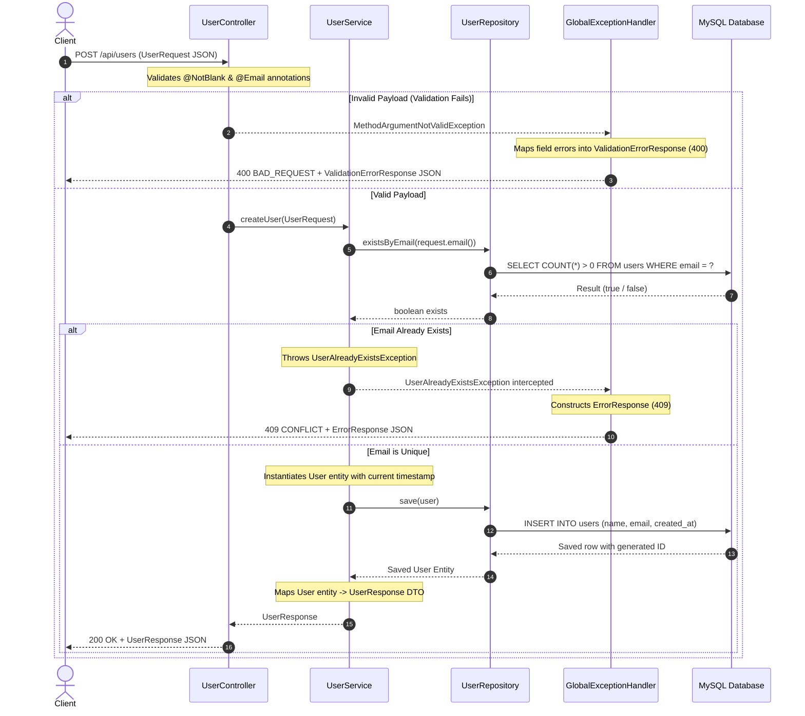
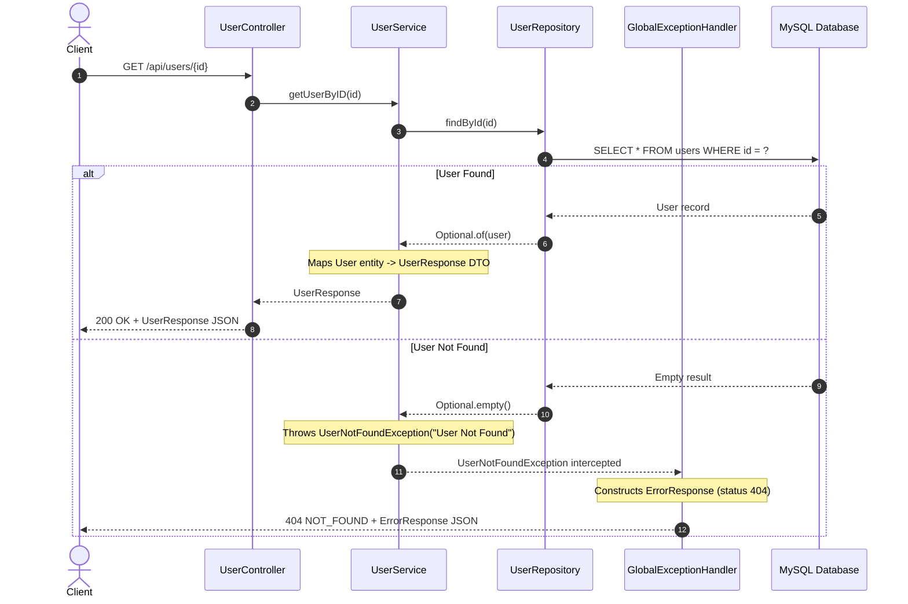
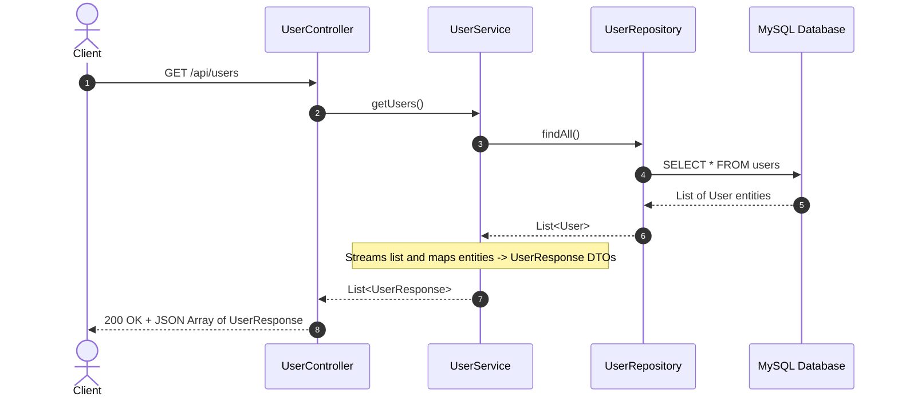

# Finance API Service

A RESTful Microservice API built with **Spring Boot 3** and **Java 21** for managing User domain data using **Spring Data JPA** and **MySQL**.

---

## 🛠️ Tech Stack & Dependencies

* **Language**: Java 21
* **Framework**: Spring Boot 3 (`spring-boot-starter-webmvc`, `spring-boot-starter-data-jpa`, `spring-boot-starter-validation`)
* **Database**: MySQL (`mysql-connector-j`)
* **API Documentation**: SpringDoc OpenAPI / Swagger UI (`springdoc-openapi-starter-webmvc-ui`)
* **Build Tool**: Maven

---

## 📂 Project Architecture & File Structure

The project follows a standard layered Java enterprise architecture with clean DTO mapping and centralized exception handling:

```
src/main/java/com/example/finance/
├── FinanceApplication.java                 # Main application entry point
├── config/
│   └── SwaggerConfig.java                  # Auto-opens Swagger UI on startup
├── controller/
│   └── UserController.java                 # REST Controller exposing endpoints (/api/users)
├── service/
│   └── UserService.java                    # Business logic, duplicate checks & DTO mapping
├── repository/
│   └── UserRepository.java                 # Data access repository (Spring Data JPA) with email check
├── entity/
│   └── User.java                           # JPA Entity for MySQL table "users"
├── dto/
│   ├── request/
│   │   └── UserRequest.java                # Immutable record payload for user creation with validation
│   └── response/
│       ├── UserResponse.java               # Success response record payload
│       ├── ValidationErrorResponse.java    # Field-level validation error response payload (400)
│       └── ErrorResponse.java              # Standard error response structure (404, 409)
└── exception/
    ├── UserNotFoundException.java          # Custom runtime exception for missing user (404)
    ├── UserAlreadyExistsException.java     # Custom runtime exception for duplicate email (409)
    └── GlobalExceptionHandler.java         # Centralized HTTP exception handler (@RestControllerAdvice)
```

---

## ⚙️ Configuration & Database Setup

The application connects to MySQL via `src/main/resources/application.properties`:

```properties
spring.application.name=finance
spring.datasource.url=jdbc:mysql://localhost:3306/FinanceDB
spring.datasource.username=root
spring.datasource.password=root
spring.datasource.driver-class-name=com.mysql.cj.jdbc.Driver

spring.jpa.hibernate.ddl-auto=update
spring.jpa.show-sql=true
spring.jpa.properties.hibernate.format_sql=true
```

Ensure MySQL is running on `localhost:3306` with the `FinanceDB` database created:

```sql
CREATE DATABASE IF NOT EXISTS FinanceDB;
```

---

## 🚀 Step-by-Step Execution Flow

### 1. Application Startup Flow

1. **Main Entry**: Execution begins at `main()` in `FinanceApplication.java`.
2. **Context Load**: `SpringApplication.run(...)` initializes the Spring ApplicationContext and reads configuration from `application.properties`.
3. **Database Schema Setup**: HikariCP connects to `jdbc:mysql://localhost:3306/FinanceDB`, and Hibernate automatically creates or updates the `users` table corresponding to the `User` entity (with unique constraint on `email`).
4. **Bean Registration**: Spring instantiates `@Service` (`UserService`), `@RestController` (`UserController`), and generates Spring Data JPA proxy implementations for `UserRepository`.
5. **Swagger UI Launch**: Once initialized (`ApplicationReadyEvent`), `SwaggerConfig.java` opens the system browser automatically to `http://localhost:8080/swagger-ui/index.html`.

---

### 2. User Creation Flow (`POST /api/users`)



1. **Client Request**: Client sends a `POST` request to `/api/users` with payload: `{"name": "John Doe", "email": "john@example.com"}`.
2. **Input Validation**: Spring Web MVC validates `@Valid @RequestBody UserRequest request`.
   * If any field violates constraints (e.g. blank name or malformed email), a `MethodArgumentNotValidException` is thrown.
   * `GlobalExceptionHandler` intercepts it and returns a `400 Bad Request` with `ValidationErrorResponse` detailing each invalid field.
3. **Duplicate Check**: `UserService.createUser()` queries `userRepository.existsByEmail(request.email())`.
   * If the email is already registered, a `UserAlreadyExistsException` is thrown.
   * `GlobalExceptionHandler` catches it and returns a `409 Conflict` with `ErrorResponse`.
4. **Persistence**: If unique, a new `User` entity is created with `LocalDateTime.now()` and saved via `userRepository.save(user)`.
5. **DTO Mapping**: The persisted `User` entity is mapped to an immutable `UserResponse` DTO and returned with `200 OK`.

---

### 3. Fetch User by ID Flow (`GET /api/users/{id}`)



1. **Client Request**: Client sends `GET /api/users/{id}`.
2. **Repository Lookup**: `userRepository.findById(id)` executes `SELECT * FROM users WHERE id = {id}`.
3. **Outcome**:
   * **Found**: Entity is transformed to `UserResponse` via `mapToResponse()` and returned with `200 OK`.
   * **Not Found**: `UserService` throws `UserNotFoundException`. `GlobalExceptionHandler` handles it and returns `404 Not Found` with `ErrorResponse`.

---

### 4. Fetch All Users Flow (`GET /api/users`)



1. **Client Request**: Client sends `GET /api/users`.
2. **Retrieval**: `userRepository.findAll()` retrieves all user records from the `users` table.
3. **DTO Transformation**: Entities are converted using `.stream().map(this::mapToResponse).toList()`.
4. **Response**: Returns a `200 OK` with a JSON array of `UserResponse` objects (preventing internal JPA entity leakage).

---

## 📡 API Endpoints Summary

| Method | Endpoint | Description | Request Body | Status Code | Response Body |
|---|---|---|---|---|---|
| `POST` | `/api/users` | Create a new user | `UserRequest` | `200 OK`<br>`400 BAD_REQUEST`<br>`409 CONFLICT` | `UserResponse`<br>`ValidationErrorResponse`<br>`ErrorResponse` |
| `GET` | `/api/users` | Retrieve all users | *None* | `200 OK` | `List<UserResponse>` |
| `GET` | `/api/users/{id}` | Retrieve user by ID | *None* | `200 OK`<br>`404 NOT_FOUND` | `UserResponse`<br>`ErrorResponse` |

---

## 📋 Request & Response Models

### 1. Request DTO (`UserRequest`)

```json
{
  "name": "John Doe",
  "email": "john.doe@example.com"
}
```

* `name`: `@NotBlank(message = "Name is required")`
* `email`: `@NotBlank(message = "Email is required")`, `@Email(message = "Invalid email format")`

---

### 2. Success Response DTO (`UserResponse`)

```json
{
  "id": 1,
  "name": "John Doe",
  "email": "john.doe@example.com",
  "createdAt": "2026-09-23T21:40:00"
}
```

---

### 3. Validation Error Response (`ValidationErrorResponse` - HTTP 400)

```json
{
  "status": 400,
  "errors": {
    "name": "Name is required",
    "email": "Invalid email format"
  },
  "timestamp": "2026-09-23T21:40:00"
}
```

---

### 4. Standard Error Response (`ErrorResponse` - HTTP 404 / 409)

#### 404 Not Found (User ID not found):
```json
{
  "status": 404,
  "message": "User Not Found",
  "timestamp": "2026-09-23T21:40:00"
}
```

#### 409 Conflict (Duplicate email):
```json
{
  "status": 409,
  "message": "User with this email already exists",
  "timestamp": "2026-09-23T21:40:00"
}
```

---

## 📖 Swagger Documentation UI

Once the application is running, Swagger UI is automatically opened in the default browser at:
```
http://localhost:8080/swagger-ui/index.html
```
